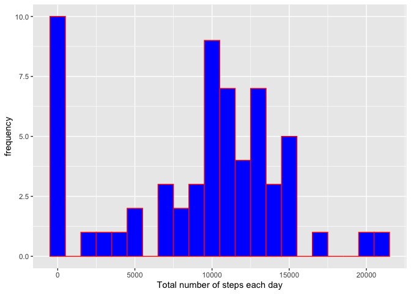
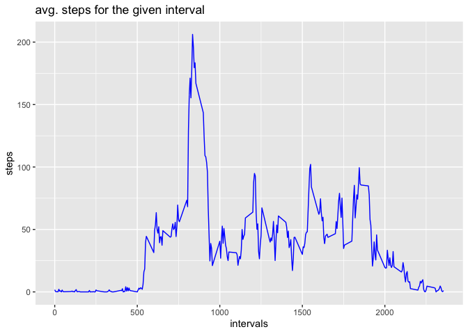
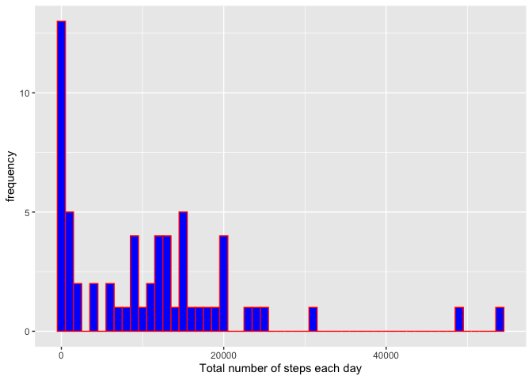
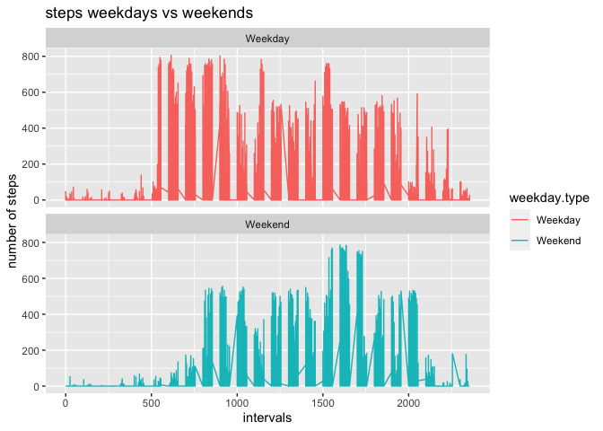

# Loading and preprocessing the data

## load libraries

```r
library(dplyr)
```

```
## 
## Attaching package: 'dplyr'
```

```
## The following objects are masked from 'package:stats':
## 
##     filter, lag
```

```
## The following objects are masked from 'package:base':
## 
##     intersect, setdiff, setequal, union
```

```r
library(ggplot2)
```

##load the data into activity

```r
activity <- read.csv("activity.csv", header = TRUE, sep = ",")
```

## check the data
verify data with summary, head an tail

```r
summary(activity)
```

```
##      steps            date              interval     
##  Min.   :  0.00   Length:17568       Min.   :   0.0  
##  1st Qu.:  0.00   Class :character   1st Qu.: 588.8  
##  Median :  0.00   Mode  :character   Median :1177.5  
##  Mean   : 37.38                      Mean   :1177.5  
##  3rd Qu.: 12.00                      3rd Qu.:1766.2  
##  Max.   :806.00                      Max.   :2355.0  
##  NA's   :2304
```

Observations:

1. There are NA values for steps
2. The interval goes in jumps of 5, up to 55, then jumping to the next 100. By looking at the maximum quantity of steps per intervals, it appears that the intervals are minutes and every jump after x55 to "x+1"00 being a jump to the next hour. Maximum number of hour is 175, which would mean around 8 days of measurement

## Data preparation:
transform an interval string into a time using the measurement date as a start date


```r
activity$hhmm<- floor(activity$interval/100)*60 + activity$interval %% 100
activity$time <- format(as.POSIXct(activity$hhmm * 60, origin = activity$date, tz = "UTC"), "%Y-%m%-%d %H:%M")
```

Identify the dayname,create and create with a function a factor variable "weekday.type to distinguish between weekdays and weekend

```r
activity$dayname<-weekdays(as.Date(activity$time))
weekend = function(x){
        if(x %in% c('Samstag', 'Sonntag')){
                return('Weekend')
        }
        
        return('Weekday')
}
activity$weekday.type = as.factor(apply(as.matrix(activity$dayname), 1, weekend))

# activity$weekday.type<-weekdays(as.Date(activity$time))
```

# Histogram of total number of steps taken each day
First we create an histogram to show the frequency 


```r
steps.day <- aggregate(activity$steps, by=list(Day = activity$date), FUN = sum, na.rm = T)
qplot(steps.day$x, binwidth = 1000, fill=I("blue"),col=I("red"),ylab = "frequency", xlab = "Total number of steps each day")
```

<!-- -->


# What is mean total number of steps taken per day?


```r
steps.mean <- round(mean(steps.day$x, na.rm = T),2)
steps.median <- median(steps.day$x, na.rm = T)
```

The mean is 9354.23 and the median is 10395 

# What is the average daily activity pattern?

We create a time series of the avg number of steps for the same interval over all days


```r
avg.steps.interval <- aggregate(activity$steps, by=list(interval=activity$interval), FUN=mean, na.rm=TRUE)
```


The series is plotted 


```r
ggplot(data=avg.steps.interval, aes(x=interval,y=x)) +
  geom_line(colour="blue") + 
  labs(x= "intervals") +
  labs(y= "steps") +
  labs(title="avg. steps for the given interval")
```

<!-- -->

# The 5-minute interval that, on average, contains the maximum number of steps


```r
max.interval <- avg.steps.interval$interval[which.max(avg.steps.interval$x)]
max.interval.hhmm <- paste(floor(max.interval/100),":",max.interval %% 100)
max.interval.steps <- round(avg.steps.interval$x[which.max(avg.steps.interval$x)],2)
```

The time interval with the maximum average (206.17) is 8 : 35

# Imputing missing values

## verify number of missing values


```r
na_steps <- sum(is.na(activity$steps))
total_steps <- length(activity$steps)
na.vs.total.steps  <- round(na_steps/total_steps*100,1)
```

The number of missing steps is 13.1%

## verify the distribution over the day of missing values


```r
activity.NA <- 
  activity %>% 
  filter(is.na(activity$steps))
  
qplot(activity.NA$interval, binwidth = 100, fill=I("blue"),col=I("red"),ylab = "frequency", xlab = "Total number of interval with no steps = NA")
```

<!-- -->

The histogram shows that the distribution is almost identical over all, therefore we could utilizing the average of the value for that interval over all days.

## substitute the NA steps value with the mean of interval over all days

```r
NoNA.activity<-merge(x = activity, y = avg.steps.interval, by = "interval", all.x = TRUE)
for (index in 1:nrow(NoNA.activity)) {
  if (is.na(NoNA.activity$steps[index]) == TRUE) {
      NoNA.activity$steps[index]<-NoNA.activity[index,"x"]
  } 
}
```

A new object NoNA.activity is created where the NA value in steps are substituted with the average over all days of the steps for the given interval

# Histogram of the total number of steps taken each day after missing values are imputed


```r
steps.day <- aggregate(NoNA.activity$steps, by=list(Day = activity$date), FUN = sum, na.rm = T)
qplot(steps.day$x, binwidth = 1000, fill=I("blue"),col=I("red"),ylab = "frequency", xlab = "Total number of steps each day")
```

<!-- -->

```r
steps.mean <- round(mean(steps.day$x, na.rm = T),2)
steps.median <- median(steps.day$x, na.rm = T)
```

The mean is 1.076619\times 10^{4} and remains unchanged, while the median changes to 1.0351623\times 10^{4} 

# Are there differences in activity patterns between weekdays and weekends?

# Prepare the data for 
We first need to calculate the average per interval for the weekdays separated from the weekend days


```r
avg.steps.interval.weekday <- aggregate(activity$steps, by=list(interval=activity$interval,weekday.type=activity$weekday.type), FUN=mean, na.rm=TRUE)

NoNA.activity.weekday<-merge(x = activity, y = avg.steps.interval.weekday, by = c("interval","weekday.type"), all.x = TRUE)
for (index in 1:nrow(NoNA.activity.weekday)) {
  if (is.na(NoNA.activity.weekday$steps[index]) == TRUE) {
      NoNA.activity.weekday$steps2[index]<-NoNA.activity.weekday[index,"x"]
  } 
  else {
  NoNA.activity.weekday$steps2[index]<-NoNA.activity.weekday[index,"steps"]
  }
}
```

# Plot the grafics

Plot two curves showing the numer of average steps per interval, one each for  "Weekday" or "Weekend" for the modified dataset

```r
y<-ggplot(data=NoNA.activity.weekday, aes(x=interval, y=steps2, group=weekday.type)) + geom_line(aes(color=weekday.type))+ facet_wrap(~ weekday.type, nrow=2) + ylab("number of steps") + labs(title="steps weekdays vs weekends") +
labs(x= "intervals") 
print(y)
```

<!-- -->
